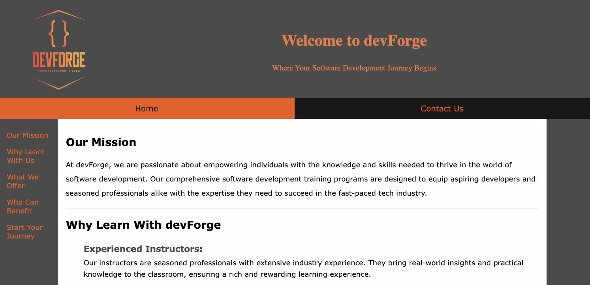
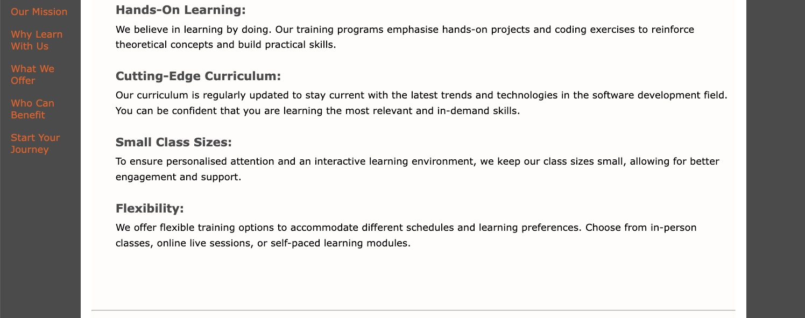
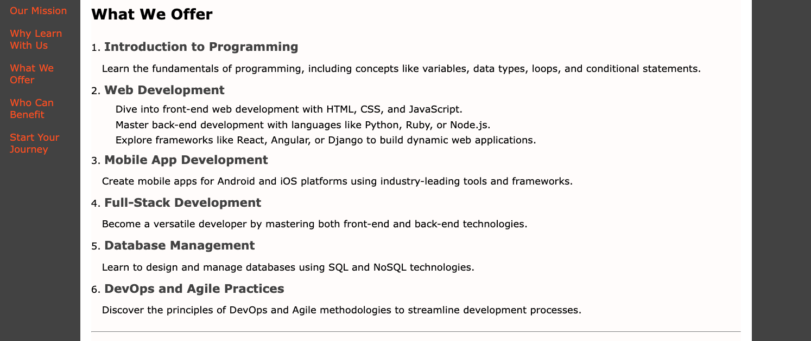
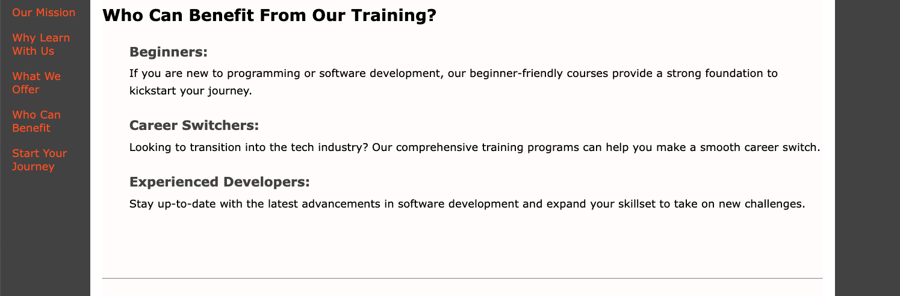
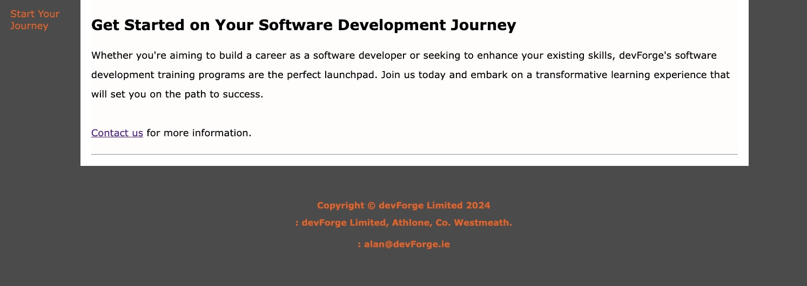
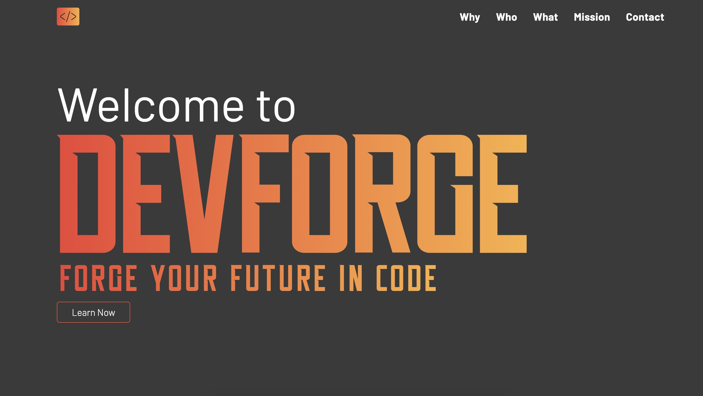

# Website Redesign - devForge.ie 

### Project Overview

> The objective of this project is to elevate the user experience, refine functionality, modernize the visual aesthetics of the current website, enhance intuitiveness, and create a visually captivating design, all while maintaining the same color palette as the previous iteration.

### Before

### After

>You can visit the new website [here!](https://devforge-ie.netlify.app/)

### Tools Used

### Contact or Connect with me!

