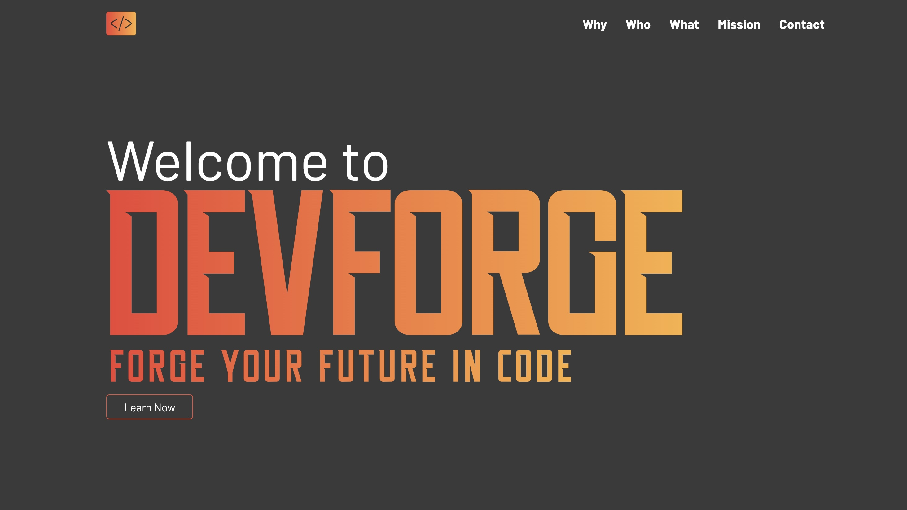

# Website Redesign - devForge.ie (under-construction)

## Project Overview 📝

The goal of this project is to enhance user experience, improve functionality, and modernize the visual aesthetics of the existing website.
Through careful analysis of owner's feedback and also industry trends, the aim is to create a more intuitive and visually appealing interface that aligns with current design standards.

## Before Screenshots 🧟‍♂️

## After Screenshots 🧚🏼‍♂️

## Conclusion ✅

...under construction.
